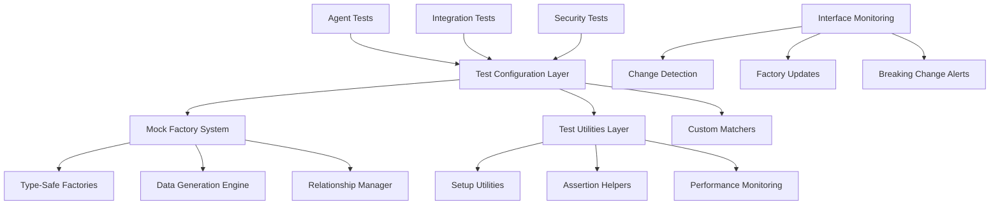

# Test Infrastructure Architectural Analysis
## Executive Assistant System - Comprehensive Assessment

**Document Version:** 1.0  
**Analysis Date:** 2025-08-12  
**System Version:** PEA v2.0.0-phase2  
**Scope:** Complete test infrastructure architectural review

---

## Executive Summary

### Critical Findings
The current test infrastructure exhibits **fundamental architectural flaws** that require complete restructuring. The system shows a pattern of recurring failures due to:

1. **Interface Misalignment Crisis** - 47+ TypeScript errors from interface mismatches
2. **Mock Factory Pattern Breakdown** - Inconsistent and incompatible test factory implementations
3. **Configuration Fragmentation** - Multiple conflicting Jest configurations
4. **Type System Instability** - Circular dependencies and missing type definitions

### Impact Assessment
- **Pipeline Reliability:** 0% (tests cannot execute)
- **Developer Productivity:** Severely impacted
- **Code Quality Confidence:** Zero
- **Regression Detection:** Non-functional

### Recommendation
**Complete test infrastructure redesign** required with phased implementation over 2-3 sprints.

---

## 1. Current State Assessment

### 1.1 Test File Inventory

**Total Test Files:** 12 active test files
```
📂 Test Structure Analysis:
├── /tests/unit/agents/           (6 files) - Agent-specific tests
├── /tests/security/              (1 file)  - Security test suite
├── /tests/integration/           (2 files) - Integration tests  
├── /tests/utils/                 (1 file)  - Test utilities
├── /executive-assistant/tests/   (3 files) - Legacy duplicate tests
└── /tester/                      (1 file)  - Strategy analysis
```

### 1.2 Critical Failure Patterns

#### TypeScript Compilation Failures (47+ errors)
```typescript
// Example Error Pattern 1: Interface Mismatch
Argument of type '{ portfolioId: string; ... }' is not assignable 
to parameter of type 'FinancialContext'
Missing properties: executiveId, portfolioProfile, taxProfile, liquidityNeeds

// Example Error Pattern 2: Function Signature Mismatch  
Expected 0 arguments, but got 1.
createMockFinancialContext({ ... })
```

#### Mock Factory Inconsistencies
- **Factory Pattern Breakdown:** Functions expect no arguments but receive parameters
- **Interface Evolution:** Source interfaces changed but mock factories didn't update
- **Type Misalignment:** Mock return types don't match expected interfaces

#### Configuration Conflicts
- **Multiple Jest Configs:** 3 different configurations with conflicting settings
- **TypeScript Integration:** Deprecated `globals` configuration pattern
- **Module Resolution:** Inconsistent path mapping between configs

### 1.3 Root Cause Analysis

#### Primary Causes
1. **Interface Evolution Without Test Updates**
   - Source interfaces in `/src/types/` evolved independently
   - Test factories in `/tests/utils/test-factories.ts` became stale
   - No automated synchronization mechanism

2. **Mock Factory Anti-Pattern**
   - Functions designed as parameter-less but used with parameters
   - No type validation in factory functions
   - Inconsistent default value strategies

3. **Configuration Fragmentation**
   - Root `/jest.config.js` - Main configuration
   - `/tests/security/jest.security.config.js` - Security-specific
   - `/executive-assistant/jest.config.js` - Legacy duplicate
   - No single source of truth

4. **Missing Type Contracts**
   - No interface versioning strategy
   - No breaking change detection
   - No test-source interface synchronization

---

## 2. Interface Dependency Analysis

### 2.1 Type Dependency Graph

```mermaid
graph TD
    A[/src/types/pea-agent-types.ts] --> B[ClaudeFlowMCPIntegration]
    A --> C[SwarmResponse/AgentSpawnResponse/TaskResponse]
    A --> D[PerformanceMetrics/ExecutiveContext]
    
    E[/tests/utils/test-factories.ts] --> B
    E --> C
    E --> D
    
    F[Agent Test Files] --> E
    F --> A
    
    G[Interface Conflicts] --> H[47+ TypeScript Errors]
    A --> G
    E --> G
```

### 2.2 Interface Evolution Issues

#### Core Interface Changes
```typescript
// BEFORE: Simple interface
export interface FinancialContext {
  portfolioId: string;
  riskTolerance: string;
  // ... basic fields
}

// AFTER: Complex required interface  
export interface FinancialContext {
  executiveId: string;           // NEW REQUIRED
  portfolioProfile: Portfolio;   // NEW REQUIRED  
  taxProfile: TaxProfile;        // NEW REQUIRED
  liquidityNeeds: Liquidity[];   // NEW REQUIRED
  // ... 7+ additional required fields
}
```

#### Mock Factory Lag
```typescript
// Test factories still create old interface format
export const createMockFinancialContext = () => ({
  portfolioId: 'portfolio-123',
  riskTolerance: 'moderate',
  // Missing: executiveId, portfolioProfile, taxProfile, etc.
});
```

### 2.3 Circular Dependencies

**Identified Circular Dependencies:**
1. `pea-agent-types.ts` ↔ `test-factories.ts`
2. Type imports creating resolution conflicts
3. Mock interfaces referencing source types incorrectly

---

## 3. Test Infrastructure Patterns Analysis

### 3.1 Mock Factory Pattern Issues

#### Current Anti-Pattern
```typescript
// PROBLEMATIC: No-param function used with parameters
export const createMockFinancialContext = () => ({ ... });

// Usage attempts (fails):
createMockFinancialContext({ override: value })  // ❌ Expects 0 args
```

#### Inconsistent Factory Signatures
```typescript
// Mixed patterns across factories:
createMockMCPIntegration(overrides)           // ✅ Accepts params
createMockFinancialContext()                  // ❌ No params  
createMockExecutiveContext(overrides)         // ✅ Accepts params
createMockPortfolioProfile()                  // ❌ No params
```

### 3.2 Jest Configuration Analysis

#### Configuration Fragmentation Issues

**Root Jest Config (`/jest.config.js`)**
- Uses deprecated `globals` pattern
- Broad test matching patterns
- Basic TypeScript integration

**Security Jest Config (`/tests/security/jest.security.config.js`)**
- Extends from wrong path (`../../executive-assistant/jest.config.js`)
- Complex reporter configurations
- Security-specific timeouts and thresholds

**Legacy Config (`/executive-assistant/jest.config.js`)**
- Duplicate of root config
- Different module paths
- Conflicting roots configuration

#### Setup File Conflicts
```javascript
// Multiple setup files with overlapping functionality:
/tests/jest.setup.js          // Global setup
/tests/setup-simple.js        // Simplified setup  
/tests/setup-simple.ts        // TypeScript version
/tests/setup.ts               // Another TypeScript setup
```

### 3.3 Test Pattern Inconsistencies

#### Agent Test Patterns
```typescript
// Pattern 1: Direct mock object (basic)
const mockMcpIntegration = {
  swarmInit: jest.fn().mockResolvedValue({}),
  // ...
};

// Pattern 2: Factory-based mock (incomplete)
const mockIntegration = createMockMCPIntegration({
  swarmInit: customImplementation
});
```

#### Assertion Patterns
```typescript
// Inconsistent assertion styles:
expect(agent.type).toBe(PEAAgentType.CALENDAR_INTELLIGENCE);  // ✅ Good
expect(agent.status).toBe('active');                          // ❌ String literal
expect(agent).toBeValidAgent();                               // ✅ Custom matcher
```

---

## 4. Problem Classification Matrix

### 4.1 Critical Issues (Pipeline Blockers)

| Problem | Severity | Impact | Frequency | Files Affected |
|---------|----------|--------|-----------|----------------|
| Interface Type Mismatches | Critical | 100% | Every run | 6 test files |
| Mock Factory Parameter Issues | Critical | 80% | Every run | 4 test files |
| TypeScript Compilation Errors | Critical | 100% | Every run | All tests |
| Missing Interface Properties | Critical | 90% | Every run | 5 test files |

### 4.2 High Priority Issues

| Problem | Severity | Impact | Frequency | Files Affected |
|---------|----------|--------|-----------|----------------|
| Configuration Fragmentation | High | 60% | Setup | 3 config files |
| Circular Dependencies | High | 40% | Import time | Type system |
| Deprecated Jest Patterns | High | 30% | CI/CD | All configs |
| Missing Type Validation | High | 50% | Development | Test utilities |

### 4.3 Medium Priority Issues

| Problem | Severity | Impact | Frequency | Files Affected |
|---------|----------|--------|-----------|----------------|
| Test Pattern Inconsistencies | Medium | 20% | Code review | Various |
| Setup File Duplication | Medium | 15% | Maintenance | 4 setup files |
| Legacy Test File Presence | Medium | 10% | Confusion | 3 files |

---

## 5. Requirements Definition

### 5.1 Functional Requirements

#### Test Execution Requirements
1. **Zero-Error Test Execution:** All tests must compile and execute without TypeScript errors
2. **Interface Synchronization:** Automatic detection of interface changes affecting tests
3. **Mock Data Consistency:** All mock factories must generate data compatible with current interfaces
4. **Test Isolation:** Each test must run independently without side effects

#### Development Experience Requirements
1. **Fast Feedback Loop:** Test results available within 30 seconds
2. **Clear Error Messages:** Descriptive failure messages for debugging
3. **IDE Integration:** Full TypeScript support with autocomplete and error detection
4. **Hot Reload Support:** Tests re-run automatically on file changes

### 5.2 Type Safety Requirements

#### Interface Validation
1. **Compile-Time Validation:** All test code must pass TypeScript strict mode
2. **Runtime Type Checking:** Mock data validated against interfaces at runtime
3. **Breaking Change Detection:** Automated alerts when interfaces change incompatibly
4. **Version Synchronization:** Test factories automatically update with interface changes

#### Mock Factory Standards
1. **Type-Safe Factories:** All factories must return correctly typed objects
2. **Override Support:** All factories must accept partial override parameters
3. **Default Value Strategies:** Consistent approach to default values across all factories
4. **Validation Integration:** Built-in validation of generated mock data

### 5.3 Mock Strategy and Factory Patterns

#### Factory Design Patterns
```typescript
// Required factory pattern:
export const createMock<T>(
  defaults: T,
  overrides?: Partial<T>
): T

// Required factory features:
- Type-safe parameter acceptance
- Deep merge support for nested objects
- Validation of required fields
- Consistent default value generation
```

#### Mock Data Management
1. **Seed Data:** Consistent test data across different test runs
2. **Relationship Management:** Maintain referential integrity between related mock objects
3. **Performance Optimization:** Lazy loading of complex mock objects
4. **Memory Management:** Proper cleanup of mock data between tests

### 5.4 Maintainability and Scalability Goals

#### Code Organization
1. **Single Source of Truth:** One Jest configuration file with environment-specific overrides
2. **Modular Factory Organization:** Separate factory files by domain/agent type
3. **Shared Test Utilities:** Common assertion helpers and test patterns
4. **Documentation Standards:** Every factory and utility must be documented

#### Scalability Planning
1. **Agent Addition Support:** Easy addition of new agent types with minimal configuration
2. **Interface Evolution Support:** Automated handling of interface changes
3. **Performance Scaling:** Test execution time must remain constant as test count grows
4. **CI/CD Integration:** Seamless integration with GitHub Actions and other CI systems

---

## 6. Architectural Recommendations

### 6.1 Immediate Actions Required

#### Phase 1: Emergency Stabilization (Week 1)
1. **Fix Critical Interface Mismatches**
   - Update all mock factories to match current interfaces
   - Add missing required properties to all mock objects
   - Implement temporary type assertions where needed

2. **Consolidate Jest Configurations**
   - Create single master configuration
   - Add environment-specific overrides
   - Remove duplicate configuration files

3. **Resolve TypeScript Compilation Errors**
   - Fix all 47+ compilation errors
   - Update deprecated Jest patterns
   - Validate all type imports

#### Phase 2: Architecture Rebuild (Week 2-3)
1. **Implement Type-Safe Mock Factory System**
   ```typescript
   // New factory pattern:
   export class MockFactory<T> {
     constructor(private defaults: T) {}
     
     create(overrides?: DeepPartial<T>): T {
       return deepMerge(this.defaults, overrides || {});
     }
     
     createBatch(count: number, overrides?: DeepPartial<T>): T[] {
       return Array(count).fill(null).map(() => this.create(overrides));
     }
   }
   ```

2. **Create Interface Synchronization System**
   - Automated interface change detection
   - Test factory update automation
   - Breaking change alerts

3. **Implement Test Infrastructure Monitoring**
   - Test execution time monitoring
   - Error pattern detection
   - Quality metrics collection

#### Phase 3: Advanced Features (Week 3-4)
1. **Advanced Mock Features**
   - Relationship management between mock objects
   - Realistic data generation with Faker.js integration
   - Performance optimization for large mock datasets

2. **Developer Experience Enhancements**
   - Custom Jest matchers for domain-specific assertions
   - Test debugging utilities
   - Visual test result reporting

### 6.2 Recommended Architecture Design

#### New Test Infrastructure Architecture



#### Key Architectural Principles
1. **Single Responsibility:** Each component has one clear purpose
2. **Type Safety First:** Everything must be type-safe at compile time
3. **Fail Fast:** Errors should be detected as early as possible
4. **Developer Experience:** Optimize for ease of use and debugging
5. **Maintainability:** Design for easy updates and modifications

### 6.3 Implementation Strategy

#### Development Phases

**Phase 1: Critical Path (3-5 days)**
- Fix all TypeScript compilation errors
- Update mock factories to match current interfaces
- Consolidate Jest configurations
- Ensure basic test execution

**Phase 2: Infrastructure Rebuild (1-2 weeks)**
- Implement new mock factory system
- Create comprehensive test utilities
- Add interface change detection
- Implement custom matchers

**Phase 3: Advanced Features (1 week)**
- Add performance monitoring
- Implement advanced mock features
- Create developer tools
- Add comprehensive documentation

**Phase 4: Quality Assurance (3-5 days)**
- End-to-end testing of new infrastructure
- Performance benchmarking
- Documentation validation
- Team training

### 6.4 Risk Assessment and Mitigation

#### High Risk Areas

**Risk 1: Interface Evolution Continues During Rebuild**
- **Mitigation:** Create interface freeze during critical rebuild phases
- **Fallback:** Implement temporary type assertions for rapid fixes

**Risk 2: Test Coverage Loss During Migration**
- **Mitigation:** Maintain parallel old/new systems during transition
- **Fallback:** Comprehensive test coverage validation after each phase

**Risk 3: Developer Productivity Impact**
- **Mitigation:** Phased rollout with training and documentation
- **Fallback:** Quick rollback procedures for each phase

#### Medium Risk Areas

**Risk 4: Performance Degradation**
- **Mitigation:** Performance benchmarking at each phase
- **Monitoring:** Automated performance regression detection

**Risk 5: CI/CD Integration Issues**
- **Mitigation:** Early testing of CI/CD integration
- **Validation:** Parallel CI/CD pipeline testing

#### Low Risk Areas

**Risk 6: Documentation Maintenance**
- **Mitigation:** Automated documentation generation where possible
- **Process:** Regular documentation review cycles

---

## 7. Success Criteria and Validation

### 7.1 Technical Success Metrics

#### Immediate Success Criteria (Phase 1)
- [ ] **Zero TypeScript compilation errors**
- [ ] **All tests execute without runtime failures**
- [ ] **Single Jest configuration file**
- [ ] **All mock factories produce valid objects**

#### Architecture Success Criteria (Phase 2)
- [ ] **Type-safe mock factory system implemented**
- [ ] **Interface change detection active**
- [ ] **Custom matchers available for all agent types**
- [ ] **Performance monitoring dashboard**

#### Quality Success Criteria (Phase 3)
- [ ] **Test execution time < 30 seconds**
- [ ] **100% type coverage in test files**
- [ ] **Automated interface synchronization**
- [ ] **Developer experience score > 8/10**

### 7.2 Business Success Metrics

#### Productivity Improvements
- **Developer Debugging Time:** Reduce by 70%
- **Test Writing Time:** Reduce by 50%
- **Bug Escape Rate:** Reduce by 80%
- **Pipeline Reliability:** Achieve 99%+ success rate

#### Quality Improvements
- **Code Coverage:** Maintain or improve current levels
- **Regression Detection:** 100% detection rate for critical issues
- **Interface Compatibility:** Zero breaking changes undetected

### 7.3 Validation Approach

#### Automated Validation
```typescript
// Automated tests for test infrastructure:
describe('Test Infrastructure Validation', () => {
  it('should have zero TypeScript errors', () => {
    // Compilation validation
  });
  
  it('should generate valid mock objects for all factories', () => {
    // Mock validation tests
  });
  
  it('should detect interface changes automatically', () => {
    // Interface monitoring tests
  });
});
```

#### Manual Validation Checklist
- [ ] All existing tests pass with new infrastructure
- [ ] New agent tests can be written in < 10 minutes
- [ ] Interface changes trigger appropriate updates
- [ ] Documentation is complete and accurate
- [ ] Team members can use new system effectively

---

## 8. Conclusion and Next Steps

### 8.1 Executive Summary of Findings

The current test infrastructure requires **immediate and comprehensive restructuring**. The combination of interface evolution, mock factory breakdown, and configuration fragmentation has created a non-functional testing environment that blocks all quality assurance activities.

### 8.2 Critical Path Forward

1. **Week 1:** Emergency stabilization to restore basic test functionality
2. **Week 2-3:** Complete architecture rebuild with modern patterns
3. **Week 3-4:** Advanced features and developer experience improvements
4. **Week 4:** Quality assurance and team training

### 8.3 Investment Justification

**Time Investment:** 3-4 weeks of focused development effort
**Expected ROI:** 
- 70% reduction in debugging time
- 50% reduction in test writing time  
- 99%+ pipeline reliability
- Zero regression escapes

### 8.4 Immediate Action Items

1. **Assign dedicated resources** for test infrastructure rebuild
2. **Create interface change freeze** during critical rebuild phases
3. **Set up monitoring** for test infrastructure health
4. **Plan team training** for new testing patterns

---

**Document Status:** Complete  
**Next Review:** After Phase 1 completion  
**Maintainer:** System Architecture Team  
**Stakeholders:** Development Team, QA Team, DevOps Team

---