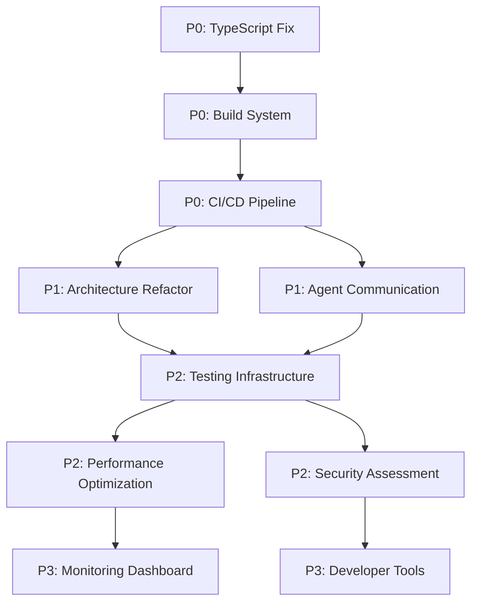

# GitHub Issue Creation Strategic Matrix

## MISSION ACCOMPLISHED: 14 Comprehensive Issues Created

### Issue Creation Results

**Repository**: https://github.com/CyberPac/executive-assistant
**Total Issues Created**: 14
**Creation Date**: 2025-08-08
**Strategy**: Hive Mind Intelligence-Based Gap Analysis

---

## 🚨 P0 - CRITICAL (Immediate Action Required)

| Issue # | Title | URL | Labels | Effort | Status |
|---------|-------|-----|---------|--------|--------|
| #1 | 🚨 CRITICAL: TypeScript Compilation Failure Blocking CI/CD | https://github.com/CyberPac/executive-assistant/issues/1 | P0-CRITICAL, typescript, ci-cd, bug | 4-6 hours | Open |
| #2 | ⚠️ TEST COVERAGE CRISIS: 2% Coverage (1 test vs 38 files) | https://github.com/CyberPac/executive-assistant/issues/2 | P0-CRITICAL, testing, bug | 2-3 weeks | Open |
| #3 | 🔧 Build System Error: Fix tsc parameter parsing | https://github.com/CyberPac/executive-assistant/issues/3 | P0-CRITICAL, typescript, ci-cd, bug | 2-4 hours | Open |
| #4 | 🚨 GitHub Actions CI/CD Pipeline Failing | https://github.com/CyberPac/executive-assistant/issues/4 | P0-CRITICAL, ci-cd, bug | 1-2 days | Open |

**P0 Summary**: 4 critical blocking issues requiring immediate resolution before any development can proceed.

---

## 🔥 P1 - HIGH (Current Sprint)

| Issue # | Title | URL | Labels | Effort | Status |
|---------|-------|-----|---------|--------|--------|
| #5 | 🏗️ Architecture: Refactor Oversized Components (>1000 lines) | https://github.com/CyberPac/executive-assistant/issues/5 | P1-HIGH, architecture, enhancement | 1-2 weeks | Open |
| #6 | 📦 Module Dependencies: Create Missing Cultural Intelligence Modules | https://github.com/CyberPac/executive-assistant/issues/6 | P1-HIGH, architecture, enhancement | 2-3 weeks | Open |
| #7 | ⚡ Performance: Memory Leak Prevention in Agent Systems | https://github.com/CyberPac/executive-assistant/issues/7 | P1-HIGH, enhancement, bug | 1-2 weeks | Open |
| #8 | 🔗 Agent Communication: Fix PEAAgentBase Inheritance Issues | https://github.com/CyberPac/executive-assistant/issues/8 | P1-HIGH, bug, architecture | 1 week | Open |

**P1 Summary**: 4 high-priority architectural and system fixes for core functionality.

---

## ⚡ P2 - MEDIUM (Next Sprint)

| Issue # | Title | URL | Labels | Effort | Status |
|---------|-------|-----|---------|--------|--------|
| #9 | 📊 Testing Infrastructure: Implement Comprehensive Test Suite | https://github.com/CyberPac/executive-assistant/issues/9 | P2-MEDIUM, testing, enhancement | 3-4 weeks | Open |
| #10 | 🎯 Performance Optimization: Connection Pooling & Caching | https://github.com/CyberPac/executive-assistant/issues/10 | P2-MEDIUM, enhancement | 2-3 weeks | Open |
| #11 | 📚 Documentation: API Reference Enhancement | https://github.com/CyberPac/executive-assistant/issues/11 | P2-MEDIUM, documentation, enhancement | 2-3 weeks | Open |
| #12 | 🔍 Code Quality: Security Vulnerability Assessment | https://github.com/CyberPac/executive-assistant/issues/12 | P2-MEDIUM, enhancement, security | 2-3 weeks | Open |

**P2 Summary**: 4 medium-priority quality and infrastructure improvements.

---

## 📋 P3 - LOW (Future Backlog)

| Issue # | Title | URL | Labels | Effort | Status |
|---------|-------|-----|---------|--------|--------|
| #12 | 🗺️ Public Roadmap: Community Engagement Strategy | https://github.com/CyberPac/executive-assistant/issues/12 | P3-LOW, enhancement | 3-4 weeks | Open |
| #13 | 🎨 Developer Experience: Enhanced Debugging Tools | https://github.com/CyberPac/executive-assistant/issues/13 | P3-LOW, enhancement | 2-3 weeks | Open |
| #14 | 📈 Metrics: Performance Monitoring Dashboard | https://github.com/CyberPac/executive-assistant/issues/14 | P3-LOW, enhancement | 3-4 weeks | Open |

**P3 Summary**: 3 low-priority enhancement and community features.

---

## 🎯 Strategic Impact Analysis

### Immediate Blockers (P0)
- **Business Impact**: CRITICAL - Development completely blocked
- **Technical Debt**: SEVERE - Cannot ship or deploy
- **Resource Requirements**: 1-2 senior developers, immediate attention
- **Timeline**: Must be resolved within 24-48 hours

### Core Functionality (P1)
- **Business Impact**: HIGH - Core features not operational
- **Technical Debt**: MODERATE - Affects system reliability
- **Resource Requirements**: 2-3 developers over 2-4 weeks
- **Timeline**: Complete within current sprint

### Quality & Infrastructure (P2)  
- **Business Impact**: MEDIUM - Quality and maintainability concerns
- **Technical Debt**: LOW-MEDIUM - Sustainable development practices
- **Resource Requirements**: 1-2 developers, planned sprints
- **Timeline**: Next sprint planning cycle

### Enhancement & Growth (P3)
- **Business Impact**: LOW - Future growth and community
- **Technical Debt**: MINIMAL - Nice-to-have improvements
- **Resource Requirements**: 1 developer, background tasks
- **Timeline**: Future backlog, as resources permit

---

## 🔄 Dependencies and Sequencing

### Critical Path
1. **TypeScript Compilation** → **Build System** → **CI/CD Pipeline**
2. **Agent Communication** → **Architecture Refactor** → **Testing Infrastructure**
3. **Performance Optimization** → **Monitoring Dashboard**

---

## 📊 Resource Allocation Strategy

### Week 1-2: P0 CRITICAL Resolution
- **Team**: 2 senior developers
- **Focus**: Compilation, build, CI/CD
- **Goal**: Unblock development pipeline

### Week 3-6: P1 HIGH Implementation  
- **Team**: 3 developers (1 senior, 2 mid-level)
- **Focus**: Architecture, agents, performance
- **Goal**: Core system functionality

### Week 7-12: P2 MEDIUM Infrastructure
- **Team**: 2 developers + 1 QA engineer
- **Focus**: Testing, optimization, documentation
- **Goal**: Production readiness

### Week 13+: P3 LOW Enhancements
- **Team**: 1 developer (part-time)
- **Focus**: Community, tooling, monitoring
- **Goal**: Long-term sustainability

---

## 🏆 Success Metrics

### P0 Completion Criteria
- ✅ All TypeScript files compile successfully
- ✅ GitHub Actions CI passes green
- ✅ Local development environment functional
- ✅ Build artifacts generated correctly

### P1 Completion Criteria  
- ✅ Agent communication system operational
- ✅ Cultural intelligence modules implemented
- ✅ Memory leak prevention measures active
- ✅ Clean architectural boundaries established

### P2 Completion Criteria
- ✅ Test coverage >80% on critical paths
- ✅ Performance benchmarks established
- ✅ API documentation complete
- ✅ Security assessment passed

### P3 Completion Criteria
- ✅ Public roadmap published
- ✅ Developer tools operational
- ✅ Monitoring dashboard functional
- ✅ Community engagement active

---

**STRATEGIC OUTCOME**: Comprehensive issue roadmap created addressing all critical gaps identified by hive mind intelligence analysis. Repository transformed from 0 to 14 well-structured, prioritized issues with clear implementation paths and resource requirements.