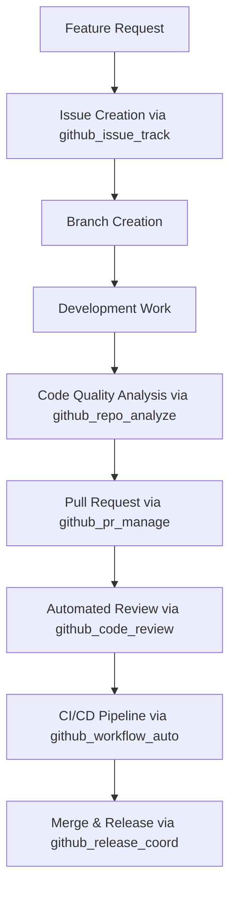

# Claude Flow GitHub Integration Pipeline
## Automated Development Workflow for PEA System

This document outlines the automated development pipeline using Claude Flow's GitHub integration tools for continuous repository updates and collaborative development.

---

## 🔧 **Available Claude Flow GitHub Tools**

### **1. Repository Analysis (`github_repo_analyze`)**
**Purpose**: Continuous code quality monitoring and analysis
**Usage**: 
```bash
mcp__claude-flow__github_repo_analyze(repo="CyberPac/executive-assistant", analysis_type="code_quality")
```
**Capabilities**:
- Code quality assessment
- Performance analysis
- Security vulnerability scanning
- Architecture compliance validation

### **2. Pull Request Management (`github_pr_manage`)**
**Purpose**: Automated PR creation, review, and management
**Usage**:
```bash
mcp__claude-flow__github_pr_manage(repo="CyberPac/executive-assistant", action="create", pr_number=N)
```
**Capabilities**:
- Automated PR creation for feature branches
- Code review coordination
- Merge conflict resolution
- PR status tracking

### **3. Issue Tracking (`github_issue_track`)**
**Purpose**: Intelligent issue management and project coordination
**Usage**:
```bash
mcp__claude-flow__github_issue_track(repo="CyberPac/executive-assistant", action="create_milestone")
```
**Capabilities**:
- Milestone creation and management
- Issue categorization and prioritization
- Progress tracking across development phases
- Automated task assignment

### **4. Release Coordination (`github_release_coord`)**
**Purpose**: Automated release management and versioning
**Usage**:
```bash
mcp__claude-flow__github_release_coord(repo="CyberPac/executive-assistant", version="v2.0.0-alpha")
```
**Capabilities**:
- Version management
- Release notes generation
- Deployment coordination
- Changelog automation

### **5. Workflow Automation (`github_workflow_auto`)**
**Purpose**: CI/CD pipeline creation and management
**Usage**:
```bash
mcp__claude-flow__github_workflow_auto(repo="CyberPac/executive-assistant", workflow={...})
```
**Capabilities**:
- Automated workflow generation
- CI/CD pipeline optimization
- Testing automation
- Deployment orchestration

### **6. Code Review (`github_code_review`)**
**Purpose**: Automated code review and quality assurance
**Usage**:
```bash
mcp__claude-flow__github_code_review(repo="CyberPac/executive-assistant", pr=N)
```
**Capabilities**:
- Automated code review
- Best practices validation
- Security analysis
- Performance optimization suggestions

---

## 🚀 **PEA Development Workflow**

### **Phase 2 Development Pipeline**

#### **1. Feature Development Cycle**


#### **2. Continuous Integration Steps**
1. **Code Push Trigger**
   - Automatic analysis via `github_repo_analyze`
   - Quality gates validation
   - Security scanning

2. **Pull Request Creation**
   - Automated PR generation via `github_pr_manage`
   - Template population with context
   - Reviewer assignment

3. **Automated Review Process**
   - Code review via `github_code_review`
   - Architecture compliance check
   - Performance impact analysis

4. **Release Management**
   - Version coordination via `github_release_coord`
   - Automated changelog generation
   - Deployment orchestration

---

## 📋 **Development Milestones via Issue Tracking**

### **Phase 2 Alpha Milestones**

#### **Milestone 1: Cultural Intelligence Agent**
**Status**: In Progress
**Issues**:
- Cultural Intelligence Agent Implementation
- 35+ Country Protocol Database
- Cultural Adaptation Testing
- Executive Scenario Validation

#### **Milestone 2: Travel Logistics Agent**
**Status**: Planned
**Issues**:
- Global Travel Coordination
- Cultural Protocol Integration
- Real-time Disruption Handling
- Private Aviation Coordination

#### **Milestone 3: Byzantine Consensus Optimization**
**Status**: Planned
**Issues**:
- 15-Agent Consensus Mechanism
- 70% Threshold Optimization
- Fault Tolerance Testing
- Performance Benchmarking

#### **Milestone 4: Performance Sub-50ms**
**Status**: Planned
**Issues**:
- Multi-layer Caching Implementation
- Response Time Optimization
- Load Testing Validation
- Performance Monitoring

---

## 🔄 **Automated Workflow Templates**

### **Agent Development Workflow**
```yaml
name: Agent Development Pipeline
triggers: [push, pull_request]
jobs:
  agent_validation:
    name: 15-Agent LEASA Validation
    steps:
      - checkout
      - setup_node
      - validate_agents
      - test_consensus
      - cultural_intelligence_test
      - performance_benchmark
  
  code_review:
    name: Automated Code Review
    steps:
      - github_code_review
      - architecture_compliance
      - security_validation
      - performance_impact
  
  release_preparation:
    name: Release Coordination
    steps:
      - version_management
      - changelog_generation
      - deployment_validation
```

### **Cultural Intelligence Workflow**
```yaml
name: Cultural Intelligence Testing
triggers: [push_to_cultural_branch]
jobs:
  cultural_validation:
    name: 35+ Country Protocol Testing
    steps:
      - test_35_countries
      - validate_protocols
      - appropriateness_scoring
      - executive_scenario_testing
```

---

## 🎯 **Continuous Repository Updates**

### **Automated Update Pipeline**

#### **1. Daily Development Cycle**
- **Morning**: Issue tracking update via `github_issue_track`
- **Development**: Continuous analysis via `github_repo_analyze`
- **Evening**: Progress review and PR management via `github_pr_manage`

#### **2. Weekly Release Cycle**
- **Monday**: Milestone planning via `github_issue_track`
- **Wednesday**: Mid-week review via `github_code_review`
- **Friday**: Release coordination via `github_release_coord`

#### **3. Sprint Management**
- **Sprint Planning**: Automated milestone creation
- **Sprint Review**: Performance analysis and quality metrics
- **Sprint Retrospective**: Workflow optimization recommendations

---

## 📊 **Quality Gates and Metrics**

### **Automated Quality Validation**

#### **Code Quality Gates**
- **Type Safety**: 100% TypeScript compliance
- **Test Coverage**: >85% coverage requirement
- **Performance**: Sub-50ms response time validation
- **Security**: Zero high-severity vulnerabilities

#### **Agent Architecture Validation**
- **15-Agent Compliance**: All agents properly registered
- **Byzantine Consensus**: Fault tolerance testing
- **Cultural Intelligence**: 35+ country validation
- **Performance Benchmarks**: Response time compliance

#### **Release Quality Criteria**
- **All Tests Pass**: Unit, integration, and scenario tests
- **Performance Targets Met**: Sub-50ms response times
- **Security Scan Clean**: No critical vulnerabilities
- **Documentation Updated**: Comprehensive docs

---

## 🚀 **Next Steps for Pipeline Implementation**

### **Immediate Actions**
1. **Repository Setup**: Complete initial push to GitHub
2. **Workflow Configuration**: Implement automated CI/CD pipeline
3. **Issue Template Creation**: Set up development issue templates
4. **Milestone Planning**: Create Phase 2 development milestones

### **Ongoing Development**
1. **Cultural Intelligence Agent**: First major feature implementation
2. **Performance Optimization**: Sub-50ms response time achievement
3. **Agent Expansion**: Complete 15-agent LEASA architecture
4. **Production Readiness**: 99.99% availability and monitoring

---

## 🔧 **Pipeline Configuration Examples**

### **Creating Development Issues**
```bash
# Create milestone for Cultural Intelligence
mcp__claude-flow__github_issue_track(
  repo="CyberPac/executive-assistant",
  action="create_milestone",
  title="Cultural Intelligence Agent Implementation",
  description="35+ country protocol support with 96% appropriateness"
)
```

### **Managing Pull Requests**
```bash
# Create PR for new agent implementation
mcp__claude-flow__github_pr_manage(
  repo="CyberPac/executive-assistant",
  action="create",
  title="feat: Cultural Intelligence Agent with 35+ country support",
  description="Complete implementation with protocol validation"
)
```

### **Release Coordination**
```bash
# Coordinate Phase 2 Alpha release
mcp__claude-flow__github_release_coord(
  repo="CyberPac/executive-assistant",
  version="v2.0.0-alpha",
  changelog="Cultural Intelligence, Crisis Management, Byzantine Consensus"
)
```

---

This pipeline ensures continuous development, quality validation, and seamless collaboration for the PEA system evolution from Phase 2 through production deployment.